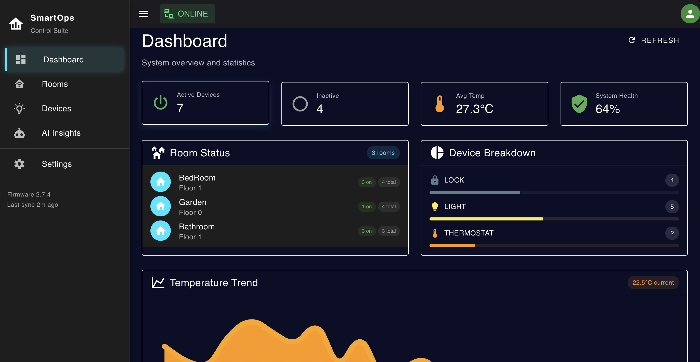
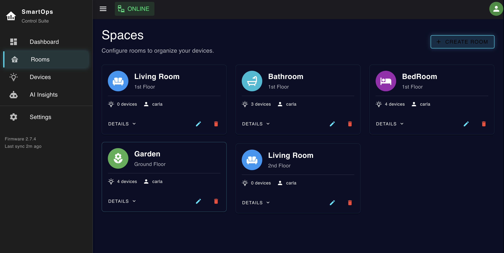
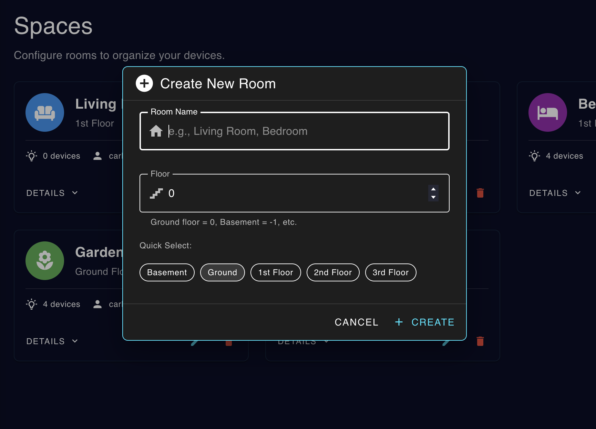
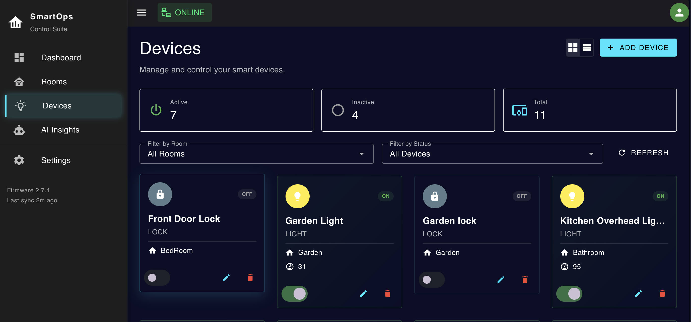
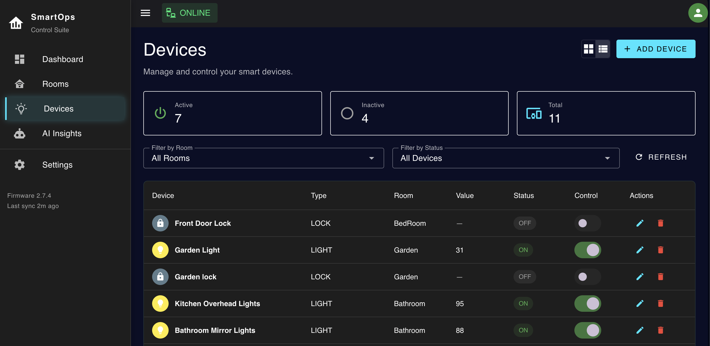
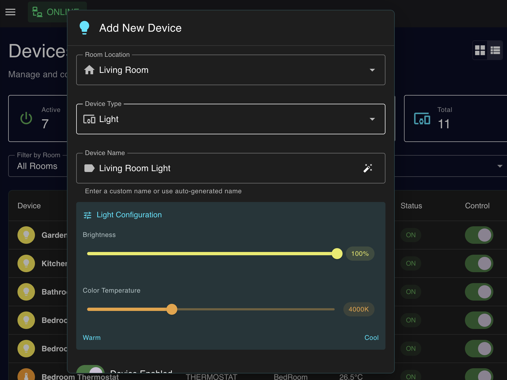
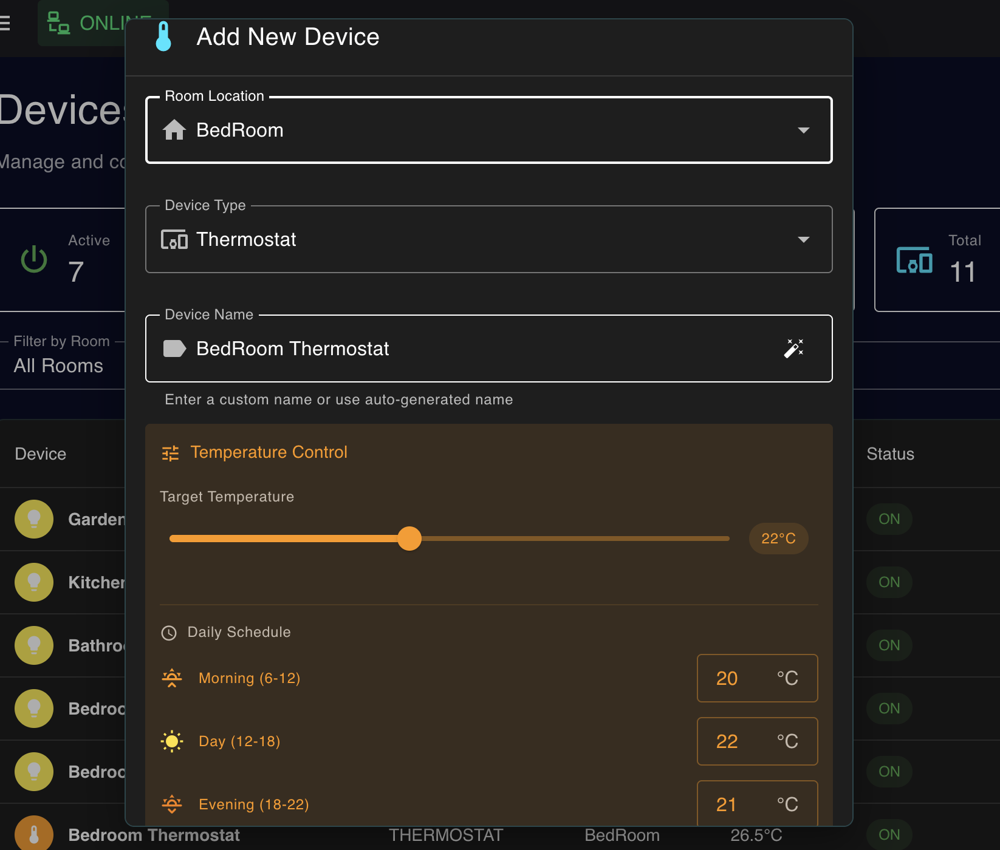
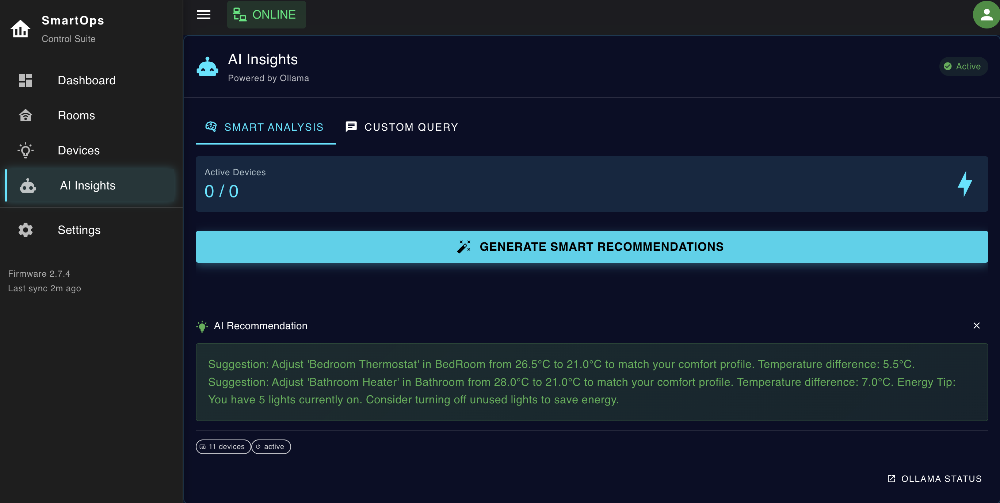
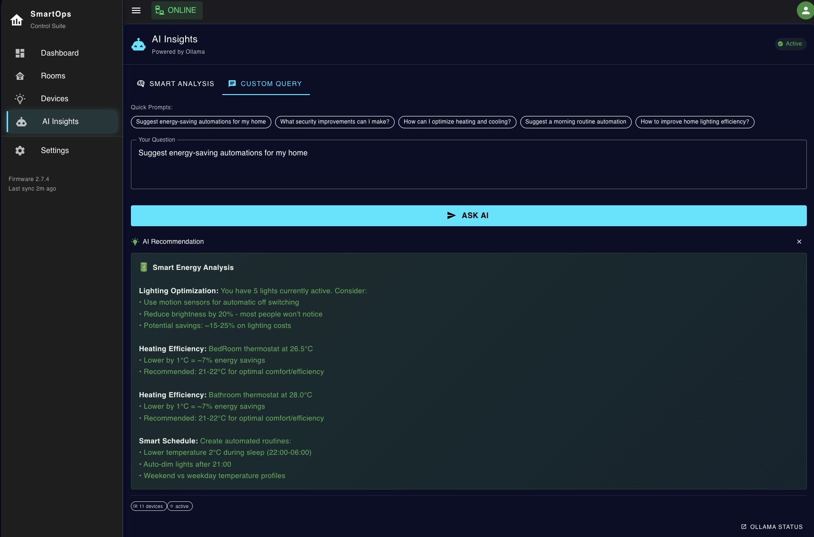
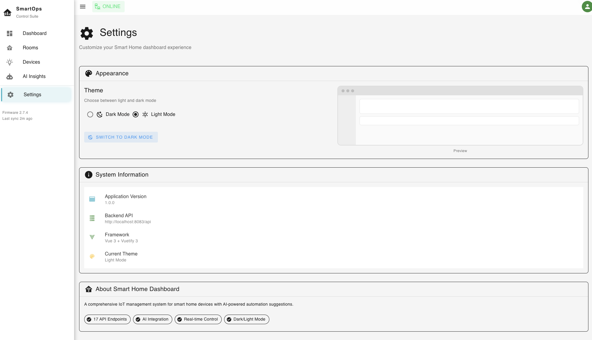

# SmartOps


**SmartOps** is a full-stack Smart Home IoT dashboard that allows users to organize rooms, manage smart devices, monitor temperature data, and receive AI-powered automation recommendations. The application combines a modern Vue.js interface with a Spring Boot backend, MySQL database, and an optional Electron desktop client.

---

## Features

- Dashboard overview with device statistics and system health  
- Room and floor-based organization for smart home spaces  
- Add, edit, delete, and filter smart devices  
- Support for lights, thermostats, and smart locks  
- Real-time device status controls  
- Device display in both card view and table view  
- Temperature monitoring and trend visualization  
- AI-powered smart home recommendations  
- Custom AI query interface powered by Ollama  
- Dark and light mode interface customization  
- Optional Electron desktop client  

---

## Tech Stack

- **Frontend**: Vue.js 3, Vuetify 3, Vite  
- **Backend**: Java with Spring Boot  
- **Database**: MySQL  
- **ORM**: Spring Data JPA / Hibernate  
- **AI Integration**: Ollama-powered recommendation system  
- **Desktop Client**: Electron  
- **Styling**: SCSS, Vuetify themes  

---

## Preview

### Dashboard Overview

Main dashboard showing active devices, inactive devices, average temperature, system health, room status, device breakdown, and temperature trends.



---

### Spaces Management

Rooms page where users can organize smart home spaces, view device counts, check floor information, and manage each room.



---

### Creating a Room

Modal for creating a new room, including room name input, floor selection, and quick floor shortcuts.



---

### Device Management - Card View

Device management page displaying smart devices as cards with room information, device type, status, value, and control actions.



---

### Device Management - Table View

Alternative table layout for managing devices in a structured view with device name, type, room, value, status, controls, and actions.



---

### Adding a Light Device

Device creation modal for configuring a smart light, including brightness and color temperature settings.



---

### Adding a Thermostat Device

Thermostat creation modal with target temperature controls and daily schedule configuration.



---

### AI Smart Analysis

AI Insights page generating smart recommendations based on active devices, thermostat settings, lighting usage, and energy efficiency.



---

### Custom AI Query

Custom query interface where users can ask for energy-saving automations, security improvements, heating optimization, and smart routines.



---

### Interface Settings

Settings page where users can switch between dark and light mode and view system information.



---

## Setup

1. Clone the repository:  
   ```bash
   git clone https://github.com/carlabarastean/SmartOps-app.git
   ```

2. Navigate to the project directory:
   ```bash
   cd SmartOps-app
   ```

3. Configure the MySQL database:

   Create a database named:

   ```sql
   CREATE DATABASE smarthomeapp;
   ```

   Then update the backend configuration in:

   ```bash
   demo/src/main/resources/application.properties
   ```

   Example configuration:

   ```properties
   spring.datasource.url=jdbc:mysql://localhost:3306/smarthomeapp
   spring.datasource.username=your_mysql_username
   spring.datasource.password=your_mysql_password

   spring.jpa.hibernate.ddl-auto=update
   spring.jpa.show-sql=true

   server.port=8083
   ```

4. Start the backend:

   ```bash
   cd demo
   ./mvnw spring-boot:run
   ```

   The backend runs on:

   ```bash
   http://localhost:8083
   ```

5. Start the frontend:

   Open a new terminal and run:

   ```bash
   cd frontend
   npm install
   npm run dev
   ```

   The frontend runs on:

   ```bash
   http://localhost:5173
   ```

6. Optional: Start the Electron desktop client:

   ```bash
   cd SmartHomeElectronClient
   npm install
   npm start
   ```

---


## Future Improvements

We’d love to take **SmartOps** even further with:

- **Real-time WebSocket updates** - Synchronize device status changes instantly across the interface.
- **Advanced authentication** - Add JWT authentication, password hashing, and role-based access.
- **Mobile companion app** - Build a mobile version for controlling devices remotely.
- **Voice assistant integration** - Connect the system with Alexa or Google Assistant.
- **Weather-based automation** - Adjust lighting and thermostat settings using external weather data.
- **Energy usage analytics** - Track consumption patterns and estimate monthly energy costs.
- **Push notifications** - Notify users about unlocked doors, high temperatures, or inactive devices.
- **Smarter AI personalization** - Improve recommendations based on user behavior and historical data.
- **Testing and CI/CD** - Add unit tests, integration tests, and automated deployment workflows.

---

## Contact

For more details or collaboration:

- Email: carlabarastean@gmail.com
- LinkedIn: [linkedin.com/in/carla-barastean-621326269](https://www.linkedin.com/in/carla-barastean-621326269)

Thank you for visiting this project!
